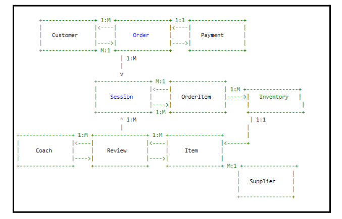

# HoopsLink: Database Design Capstone Project

## Description

For my capstone project, I will design and implement a cutting-edge platform called HoopsLink, a one-stop hub crafted to serve the comprehensive demands of basketball enthusiasts across all proficiency tiers. Nestled in the heart of a vibrant city with a rich basketball heritage, HoopsLink aims to elevate the local basketball scene by bridging the gap between coaches, players, and essential basketball gear providers.

Envisioned as a multi-faceted ecosystem, HoopsLink will streamline the connection between basketball aficionados and the resources they require to excel. The platform will encompass various services, such as personalized coaching sessions, gear procurement, and a review system that fosters a culture of continuous improvement and feedback. Whether one is taking their first dribble or preparing for professional leagues, HoopsLink is tailored to assist in their basketball journey. The cornerstone of HoopsLink is a bespoke database system that underpins the seamless operation of the platform. The database will not only handle intricate data relationships like linking players to coaches and orders to equipment but also empower users with intuitive views tailored to their specific roles. These views will enable customers to manage their profiles, schedule coaching sessions, order gear, and track payments efficiently and easily. Furthermore, coaches will be able to monitor their schedules, receive performance reviews, and interact with clients effectively.

## Business Rules for HoopsLink System

This document outlines the essential business rules that govern the operations and data management within the HoopsLink system. These rules are designed to ensure consistency, accuracy, and efficiency in handling data related to coaching, equipment ordering, and performance reviews.

### Rules

- **Unique Customer Identification**
  - **Rule:** Each customer must have a unique `customerID`. This ID is used to uniquely identify individual customers across the system and link their orders, sessions, and payments.

- **Coach Assignment**
  - **Rule:** Each coaching session must be assigned to only one coach. This assignment ensures that every session is properly managed and supervised by a qualified coach.

- **Order and Payment Linkage**
  - **Rule:** Each order must have a corresponding payment entry before the order is considered complete. This ensures financial transactions are recorded and linked to their respective orders.

- **Inventory Stock Check**
  - **Rule:** The system must not allow orders for items that have zero or negative stock quantities. This check prevents backorders and ensures that orders are fulfilled promptly.

- **Timely Performance Reviews**
  - **Rule:** Coaches must receive at least one performance review per year. This ensures ongoing assessment and improvement of coaching quality.

These rules are intended to provide a clear framework for managing interactions within the HoopsLink system and to facilitate the maintenance of high standards in customer service and operational management.

## ER Diagram

## ER Diagram Explanation for HoopsLink System

### Overview
This document provides a detailed explanation of the ER diagram for the HoopsLink system. It describes the visual elements used in the diagram and explains how entities such as "Customer," "Order," "Session," "Coach," "Review," "Payment," "OrderItem," "Item," "Inventory," and "Supplier" are interconnected.

### Textual Layout Description
- **Rectangles (`+----------------+`)**: Represent entities in the ER diagram.
- **Arrows (`<----`, `---->`)**: Indicate the direction of the relationship, pointing towards the "one" in a one-to-many (1:M) relationship.
- **Cardinality (e.g., `1:1`, `1:M`, `M:1`)**: Indicates the type of relationship between entities.

### Relationships
- **Customer to Order**:
  - `1:M` - One customer can place multiple orders, but each order is associated with only one customer.
- **Order to Payment**:
  - `1:1` - Each order has exactly one corresponding payment record, illustrating a one-to-one relationship where every individual order is paid for exactly once.
- **Order to OrderItem**:
  - `1:M` - One order can include multiple items.
- **OrderItem to Item**:
  - `M:1` - Multiple order items can refer to the same item in the inventory, meaning an item can be part of many different orders.
- **OrderItem to Inventory**:
  - `1:M` - This relationship shows that each record in the order item table relates to a single record in the inventory, indicating how many units of an item are included in the order. However, the inventory can relate to multiple order items.
- **Item to Supplier**:
  - `M:1` - Multiple items can be supplied by a single supplier, indicating that a supplier can provide various items.
- **Item to Inventory**:
  - `1:1` - Each item has a corresponding inventory record that tracks the stock quantity of that item. This relationship implies that each item has one inventory record that tracks its available stock.
- **Session to Coach**:
  - `M:1` - Multiple sessions can be conducted by the same coach, but each session is associated with only one coach.
- **Review to Coach**:
  - `1:M` - A coach can have multiple reviews written about them, suggesting that each review pertains to one coach, but a coach can accumulate many reviews over time.

This ER diagram provides a simplified, conceptual model of the relationships and cardinalities between different entities in the HoopsLink system. It illustrates how different aspects of the business—customers, orders, payments, coaching sessions, reviews, and inventory—are interrelated within the database, providing a foundational structure for understanding data interactions.

